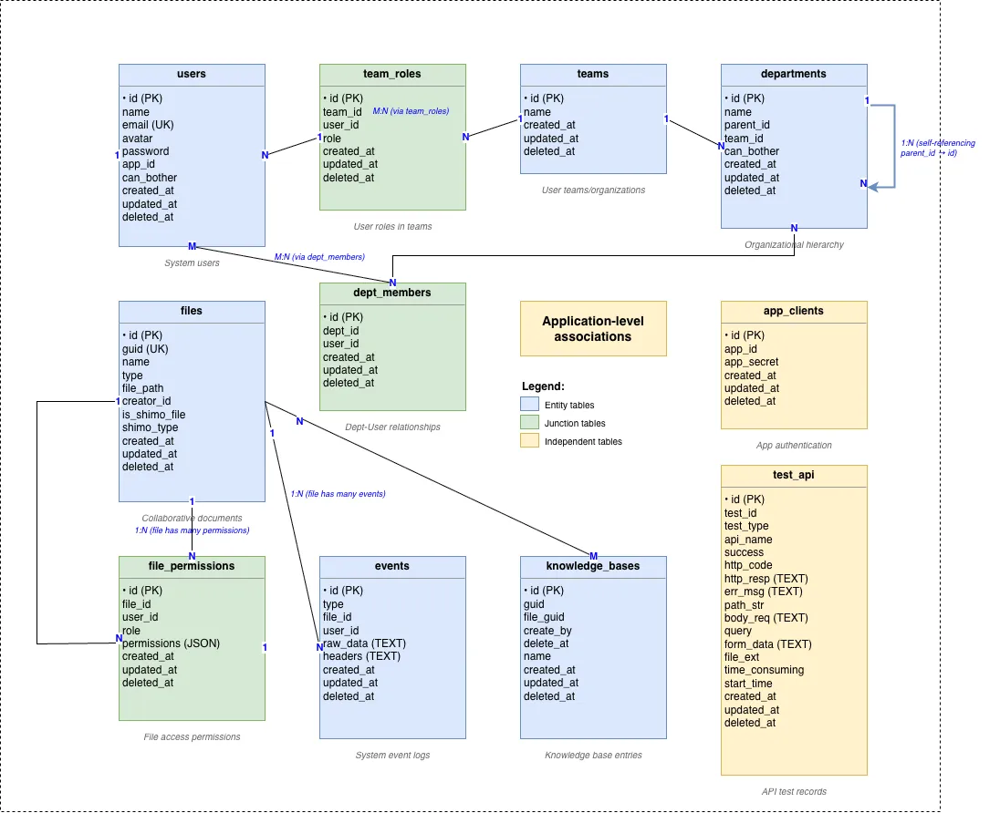

# Shimo SDK Go Demo

## Project Overview

This is a Shimo SDK Go demonstration project based on Ego, providing complete API integration examples for the Shimo document collaboration platform. The project demonstrates how to interact with the Shimo SDK through a Go backend service to implement document management, user management, team collaboration, and other features.

The specific architecture for SDK integration is shown in the diagram below. This project implements the yellow-highlighted parts in the diagram:


## Project Structure

```
.
├── cmd/                        # Command-line tools
│   ├── server/                 # Server startup commands
│   └── sdkctl/                 # SDK testing tool
├── config/                     # Configuration files (local/production)
├── database/                   # Database initialization scripts
├── pkg/                        # Core business packages
│   ├── consts/                 # Constant definitions (file types, permissions, APIs, etc.)
│   ├── invoker/                # Dependency injection container (global component management)
│   ├── models/                 # Data models
│   │   └── db/                 # Database models (users, files, teams, etc.)
│   ├── server/                 # Server implementation
│   │   └── http/               # HTTP service
│   │       ├── api/            # API endpoints (user, file, team management, etc.)
│   │       ├── callback/       # Shimo callback implementations
│   │       └── middlewares/    # HTTP middlewares (authentication, callback validation, etc.)
│   ├── services/               # Business service layer
│   │   ├── signature/          # JWT signature service
│   │   ├── awos/               # Object storage service (S3/MinIO)
│   │   └── inspect/            # Web inspection service
│   └── utils/                  # Utility functions (JWT, crypto, file handling, etc.)
├── resources/                  # Resource files
│   └── import/                 # Import test files (various formats)
├── scripts/                    # Script files
│   └── build/                  # Build scripts
├── ui/                         # Frontend project (React + TypeScript)
│   ├── public/                 # Static assets
│   └── src/                    # Source code
│       ├── constants/          # Frontend constants
│       ├── layouts/            # Page layouts
│       ├── models/             # Frontend data models
│       ├── pages/              # Page components
│       ├── services/           # API service calls
│       ├── utils/              # Frontend utility functions
│       └── wrappers/           # Route wrappers
├── Dockerfile                  # Docker image build file
├── Makefile                    # Make build configuration
├── go.mod                      # Go module definition
├── go.sum                      # Go dependency checksums
├── main.go                     # Program entry point
├── README.md                   # Project documentation (English)
└── README_CN.md                # Project documentation (Chinese)
```


## Frontend Code Location

[ui/](ui/)

## Frontend Tech Stack

- React
- Typescript
- Ant-Design

## Backend Tech Stack

- **Framework**: Ego, Gin
- **Database**: MySQL
- **Authentication**: JWT
- **File Storage**: AWS S3/MinIO

## Database Design

### ER Diagram



### Database Tables

- **users**: User table, stores system user information
- **teams**: Team table, basic organizational unit
- **team_roles**: Team role table, user roles within teams (creator/manager/member)
- **departments**: Department table, organizational structure within teams
- **dept_members**: Department member table, user-department associations
- **files**: File table, stores collaborative documents and uploaded files
- **file_permissions**: File permission table, user access permissions for files
- **events**: Event table, records various system events
- **knowledge_bases**: Knowledge base table, knowledge base related information
- **app_clients**: Application client table, stores application credentials
- **test_api**: API test record table, records API test results

## Database Initialization

Please execute the SQL statements in the [database/1_init.up.sql](database/1_init.up.sql) file to initialize the database.

```bash
mysql -u your_username -p < database/1_init.up.sql
```

Or execute the file directly in your MySQL client.

## Service Startup

### Backend Startup

#### Using Makefile (Recommended)

```bash
make server
```

#### Using Go Command Directly

```bash
go run main.go server --config=config/local.toml
```

Configuration file: [config/local.toml](config/local.toml)

#### Build Binary

```bash
make build
```

After building, the executable file will be located in the `bin/sdk-demo-go` directory.

### Frontend Startup

#### Requirements

- Node.js: 16.x
- Ant Design: <= 4.20.x
- Umi: 4.x

#### Startup Steps

1. Navigate to the frontend directory

```bash
cd ui
```

2. Install dependencies

```bash
npm install
```

3. Configure proxy (if needed)

Ensure the proxy property in [ui/.umirc.ts](ui/.umirc.ts) or related configuration files points to the backend service address (default: `http://localhost:9301`)

```json
{
  "proxy": {
    "/api": {
      "target": "http://localhost:9301",
      "changeOrigin": true,
      "pathRewrite": { "^/api": "" }
    }
  }
}
```

4. Start the development server

```bash
npm run dev
```

#### Build for Production

```bash
npm run build
```

## API Endpoints

### Authentication

- `POST /api/sign` - Get JWT token
- `POST /api/signByClientName` - Get JWT by client name

### User Management

- `POST /api/users/signin` - User login
- `POST /api/users/signup` - User registration
- `GET /api/users/{userId}` - Get user information
- `GET /api/users/{userId}/teams` - Get user teams

### File Management

- `GET /api/files` - Get user file list
- `POST /api/files/upload` - Upload file
- `POST /api/files/import` - Import file
- `POST /api/files/{fileGuid}/export` - Export file
- `GET /api/files/{fileGuid}/open` - Open file

### Team Management

- `GET /api/teams` - Get team list
- `POST /api/teams` - Create team
- `GET /api/teams/{teamId}/members` - Get team members
- `POST /api/teams/{teamId}/departments` - Create department

### Application Management

- `GET /api/apps/{appId}` - Get application details
- `PUT /api/apps/{appId}/endpoint-url` - Update application callback URL

## FAQ

### 1. Database Connection Failed

- Check if the database service is running
- Verify connection string and credentials
- Confirm network connectivity

### 2. Shimo SDK Call Failed

- Verify that AppID and AppSecret are correct
- Verify that callbacks are configured correctly
- Check network connection and firewall settings
- Review SDK logs for detailed error information

### 3. File Upload Failed

- Check file storage service configuration
- Verify file size limits
- Confirm storage permission settings
